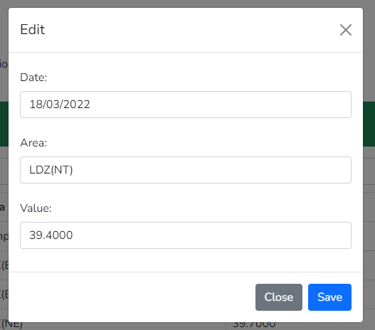

# Laravel Demo

## Description

A small demo of scraping data from a web page, or adding via uploading a CSV, and multi-facet filtering on the dataset. All done with [Laravel](https://laravel.com/) and [Livewire](https://livewire-framework.com/).

### Download data
##### To download CSV, go to http://mip-prd-web.azurewebsites.net/DataItemExplorer and follow these steps from 1 to 4.


### Admin portal


### All records


### Filter by an area name or calorific value or date


### Edit or Delete



## Installation

1. Clone, `composer install`, `yarn install`, configure `.env` and your DB connection.

2. Migrate and seed the DB.

```bash
php artisan migrate
```

3. Go to "/admin" URL to load data using Fetch or by uploading a CSV.

4. Go to "/dashboard" to view the front-end.
